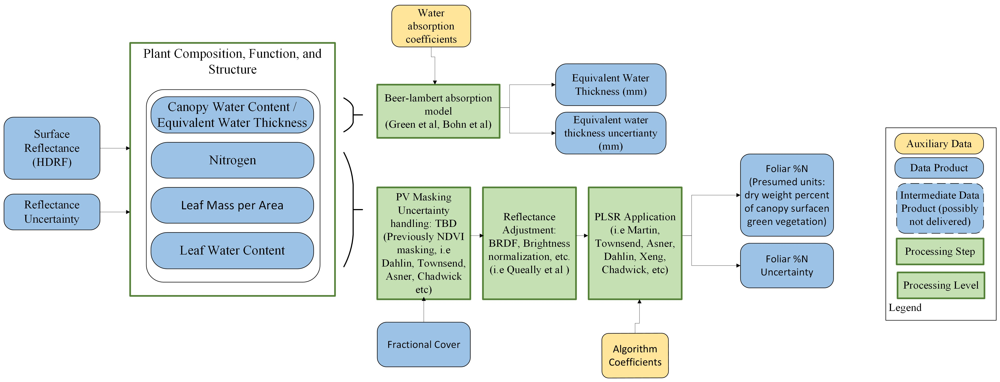

# sbg-terrestrial-veg

This repository will ultimately contain all code and documentation to generate the SBG-VSWIR terrestrial vegetation products. At present, it is a work in progress, with the primary focus on the Algorithm Theoretical Basis Documents (ATBD). 

NASA's Surface Biology and Geology (SBG) Mission Visible to Shortwave Infrared (VSWIR) terrestrial vegetation algorithm team has committed to providing demonstration products for the following variables (Figure 1):

    1. Canopy Water Content (CWC)/ Equivalent Water Thickness (EWT) (Units: cm), 
    2. Leaf Mass Per Area (LMA) (Units: g m-2)
    3. Foliar Nitrogen (N) (Units: g N/g dry mass)
    4. Leaf Water Content (LWC) (Units: %) - leaf level water as % of fresh leaf weight 

<figure>
    
    <figcaption>Figure 1: Proposed terrestrial vegetation demonstration products for SBG </figcaption>
</figure>

CWC will be calculated using the Bohn et al, 2020 three phases of water approach. Currently, the the team is focused on using a partial least squares regression (PLSR) framework for trait estimates of LMA, Foliar N, and LWC; however, this algorithm approach still requires further research and testing at the plot, airborne, and space born scales. 
This repository contains two ATBD documents in the `docs` folder describing the two current algorithm approaches:

1) [EWT_ATDB.md](docs/EWT_ATBD.md) - describes the Bohn et al, 2018 method for CWC calculation. 
2) [Trait_ATBD.md](docs/Trait_ATBD.md) - describes the PLSR appraoch for trait estimation of the other three demonstation products. 

Within the `algorithms` folder we include the algorithms code, as well as, examples to run the code using Juypter Notebooks. 

Our SBG-VSWIR terrestrial vegetation algorithms also lists our goals, projects, and overall SBG mission updates on this [Github Project Board](https://github.com/orgs/sbg-vswir/projects/2/views/2). Although our team is not currently open to the public, we are actively considering other algorithm options and welcome the feedback and contributions from the community. To learn more about how to contribute to these repositories, please follow these guidelines ~(guidelines coming soon).

To streamline the community's ability to develop and test terrestrial vegetation algorithms, our team is developing the SBG Plant Traits and Spectral (PLANTS) database (Figure 2). SBG PLANTS will integrate field and airborne data (radiance, reflectance, uncertainties, observation geometry), along with metadata, and provide users with interactive tools to facilitate the modeling of transferable and sensor-agnostic algorithms.

PLANTS is a PostGIS ER database deployed on Amazon Relational Database Services (AWS-RDS). It extends PostgreSQL's capabilities by supporting the storage, indexing, and querying of spatial data. The SQL-based ER architecture is flexible and can be redesigned under a version control system to incorporate other existing dataset structures from the SBG community and partners (e.g., SHIFT, EnSpec, NEON, Your data!) on an open platform that ensures data is findable, accessible, interoperable, and reusable. 

<figure>
    
    <figcaption>Figure 2: SBG Plant Traits and Spectral (PLANTS) database (Figure 2)</figcaption>
</figure> 

We do not have release date scheduled yet, but watch our project board for progress. 

References:
Bohn, N., Guanter, L., Kuester, T., Preusker, R., & Segl, K. (2020). Coupled retrieval of the three phases of water from spaceborne imaging spectroscopy measurements. Remote Sensing of Environment, 242, 111708.

