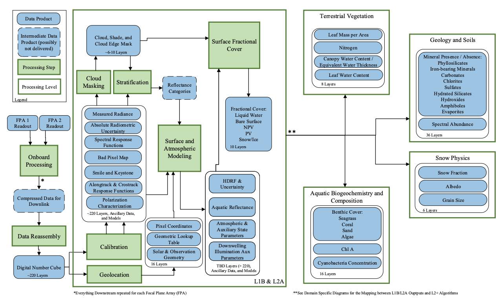
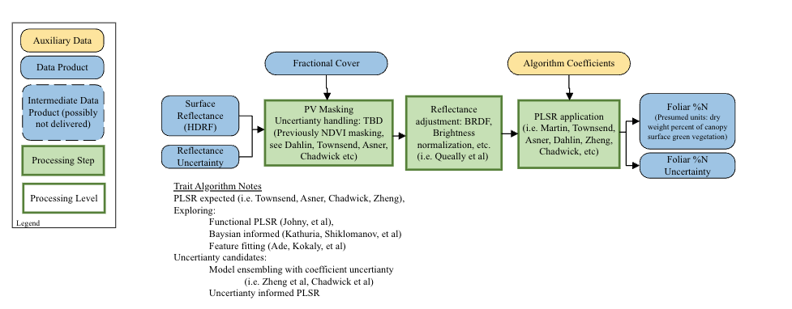
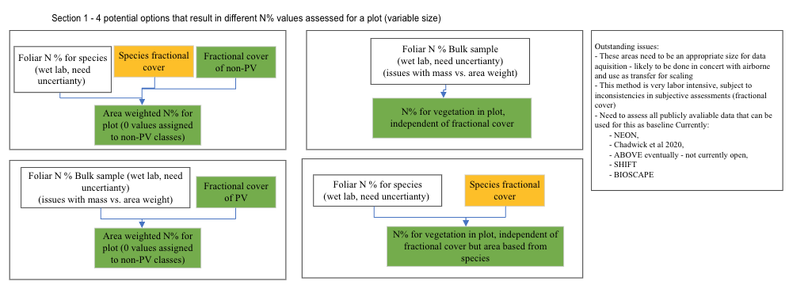

# SBG VSWIR Terrestrial Vegetation Canopy Surface Trait Products - Algorithm Theoretical Basis Document (ATBD)**

*K.D. Chadwick**1

1Jet Propulsion Laboratory, California Institute of Technology

Corresponding author: K. Dana Chadwick (dana.chadwick@jpl.nasa.gov)

**Key Points:**
1. Please note that this ATBD will be updated on an ongoing basis as the SBG VSWIR project progresses. This is intended to be a place where the community can find the most up-to-date information on the current plans for algorithm development and offer contributions. 
2. The canopy surface trait demonstration products are baselined to be generated with a partial least squares regression (PLSR) framework. The team is actively consdiering other algorithm options and welcomes contributions from the community. 
3. The products will include foliar nitrogen, leaf mass per area, and leaf water content.

**Version:** 1.0

**Release Date:** TBD

**DOI:** TBD

## Abstract

## Plain Language Summary

### Keywords: 
Vegetation Traits,
Canopy Nitrogen,
Leaf Mass Per Area,
Leaf Water Content

## 1 Version Description

This is Version 1.0 of the SBG VSWIR terrestrial vegetation algorithms for top of canopy traits.

## 2 Introduction

The NAS 2017 Decadal Survey called for a new generation of satellite missions to address critical science questions related to the Earth's surface and interior. The Surface Biology and Geology (SBG) mission was one of the missions recommended in the Decadal Survey. The SBG mission is designed to address key science questions related to the Earth's surface and interior, including the carbon cycle, terrestrial vegetation dynamics, and the water cycle. The mission is comprised of two satellite projects, the visible to shortwave infrared imaging spectrometer (VSWIR) Project and the thermal infrared (TIR) Project. This document describes the algorithm theoretical basis for the VSWIR terrestrial vegetation canopy surface trait products that are tracable to satisfying the science needs outlined in the Decadal Survey. 

This ATBD will cover the product generation for all terrestrial vegetation algorithms that are generated using a partial least squares regression (PLSR) framework. At the time of writing, this will include the following properties estimated for the phtosyntheic vegetation canopy surface observable from the VSWIR instrument: foliar nitrogen (N), leaf mass per area (LMA), and leaf water content (LWC). These products are generalized into a single ATBD because they use a similar algorithmic framework and are generated using the same input data.
 
## 3 Context/Background

The PLSR derived terrestrial vegetation properties are situated in the larger context of the SBG VSWIR algorithm pipeline. The full algorithm pipeline can be seen in Figure 1 below.

**Figure 1.** _Map of SBG VSWIR algorithm pipeline._

This pipeline is the expected framework as of the time of writing, but is subject to change as the mission progresses. 

### 3.1 Historical Perspective

### 3.2 Additional Information

## 4 Algorithm Description

**Figure 2.** _Map of PLSR algorithm for terrestrial vegetation demonstration products._

### 4.1 Scientific Theory
These algorithms are intended to estimate the trait values of the green vegetation in the plant canopies that are within a pixel. While some pixels will be comprised of 100% photosynthetic vegetation (PV), many pixels will be mixed with other surface types. The PLSR algorithm is designed to estimate the trait values for the PV fraction of the pixel. The PLSR algorithm is trained on a large dataset of field measurements of the traits of interest and the corresponding reflectance spectra. The algorithm is trained to find the linear combination of the reflectance spectra that best predicts the trait values. The algorithm is then applied to the reflectance spectra of the pixels in the VSWIR image to estimate the trait values. These algorithms have been developed on a one off basis to date within specific study areas across different ecosystems, with different sensors and processing pipelines, and at different ground sampling distance (GSD). The SBG VSWIR project will have to aggregate appropriate datasets from existing studies and develop a new set of algorithms that can be applied to the SBG VSWIR data.

There are a variety of challenges to overcome in order to develop these algorithms, which the terrestrial vegetation algorithm working group is working to address. As of Q1 2025 the working group is focused on the following challenges and we will update this document as the project progresses.  

- **Bringing together existing field and airborne datasets.** We're developing a database of field and airborne datasets that can be used to train and validate the algorithms. This includes datasets from the National Aeronautics and Space Administration (NASA) Airborne Visible/Infrared Imaging Spectrometer (AVIRIS) program supported activities, including and the National Ecological Observatory Network (NEON). A large challenge in this aggregation effort is that different platforms utilize different atmospheric correction and reflectance retrieval algorithms, which can lead to differences in the reflectance spectra. We are looking to start from radiance data rather than reflectance data to avoid these issues. However, this requires a good deal of work to re-extract data from flightlines and processing pixel level radiance to consistent reflectance data. 

- **Strategies for trait value aggregation from in situ collections to pixel resolution.** There are a variety of ways that a canopy trait value for a particular pixel can be determined from in situ data. There are also questions about if the goal is to estimate the value of PV traits per pixel, ignoring the non-PV fraction, or if the goal is to estimate the value of PV traits for the area of the pixel, setting non-PV cover to a value of zero. We are baselining the former scenario. The diagram below highlights the differences in aggregation approaches that could be utilized.  **Figure 3.** _Outline of various aggregation methods for canopy foliar traits._  
 
- **Determining which pixels will have the PLSR algorithms applied.** The PLSR algorithms are designed to estimate the trait values for the PV fraction of the pixel. The algorithms will only be applied to pixels that have a PV fraction above a certain threshold. The working group is currently working on determining the appropriate threshold for SBG VSWIR data utilizing data from the SHIFT project. There is a placeholder in section 4.4 for the threshold value. 

- **Scaling from airborne to spaceborne.** The algorithms have been developed on airborne data, which often has a much higher spatial resolution than the planned GSD of SBG VSWIR. The working group is assessing methods for scaling trait models to coarser GSDs by leveraging EMIT as a precursor. This scaling may include developing a method to aggregate the airborne data to the SBG VSWIR pixel size and utilizing those data to train the coarser resolution PLSR algorithms.  

#### 4.1.2 Scientific theory assumptions

The 

### 4.2 Mathematical Theory

#### 4.2.1 Mathematical theory assumptions

### 4.3 Algorithm Input Variables

The input variables for terrestrial vegetation PLSR products are: isofit corrected reflectance and uncertianty (L2a), fractional cover and uncertianty (L2b_FRAC).  

### 4.4 Algorithm Output Variables

Output variables for foliar nitrogen, leaf mass per area, and leaf water content are generated for each pixel in the input data with a fractional cover >= 0.XX photosynthetic vegetation. For all other pixels, the output is set to NaN. Units are as follows: foliar nitrogen (g N/g of dry foliar mass), leaf mass per area (g dry mass/m^2 of leaf area), and leaf water content (g water/g fresh foliage). Uncertianties are also generated for each output variable in the same units as the output variable.

## 5 Algorithm Usage Constraints
The algorithms will be developed with the datasets avaliable to the team. There are not currently any plans for SBG VSWIR to fund in situ data collection activities. Therefore the algorithms will be most appropriate for interpretation within the regions where there are training data available. This ATBD will contain a map and list of the regions that have training data for individuals to assess the likely reliability in their region of interest. The SBG VSWIR terrestrial vegetation team is working to compile a series of protocols for the community to use in support of improving the VSWIR terrestial vegetation algorithms. The team anticipates working with the community to gather the largest possible training dataset and will continue to update the PLSR coefficients as new data become available.

## 6 Performance Assessment
The terrestrial vegetation algorithms are part of the demonstration product suite that will be provided by SBG VSWIR. These products will be spot verified as possible. The team will do the best performance assessment possible with the data available.

### 6.1 Validation Methods

### 6.2 Uncertainties

### 6.3 Validation Errors

## 7 Algorithm Implementation

### 7.1 Algorithm Availability
All algorithms will be avaliable through the SBG-VSWIR github repository. 

### 7.2 Input Data Access
All input data will be avaliable on the LP DAAC.

### 7.3 Output Data Access
All output data will be avaliable on the LP DAAC.

### 7.4 Important Related URLs

## 8 Significance Discussion

## 9 Open Research

## 10 Acknowledgements

## 11 Contact Details

## References